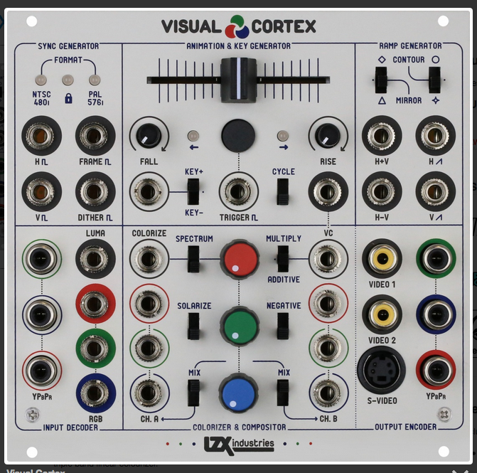

# hw01: Repository for first CFSS homework assignment

## Who
My name is Frances Mendes Levitin.  I am a first year student in the *Department of Visual Arts* (DoVA) at University of Chicago. To see more art go to by website by clicking this [link](http://45.55.61.6:3000/).  

### Art Practice Activities
* Scavenging   
* Programing  
* Hacking  
* Live Audio/Visual performance
* Painting

**ANALOG VIDEO MIXER I hope to build myself**

#### Reflection on workflow  
I've had some experience using git and github, so I used the terminal for parts of the process.  I first forked the repository from the class's github page.  Next, I opened the terminal on my local machine and cloned the form by executing the command "git clone <HTTP repo on github>".  Next I opened up the file README.md in RStudio and creted a new project from my existing directory.  I made changes localy to the file in RStudio.  Finally, when I finished the assignment I commited my changes and pushed to my forked repository.  

